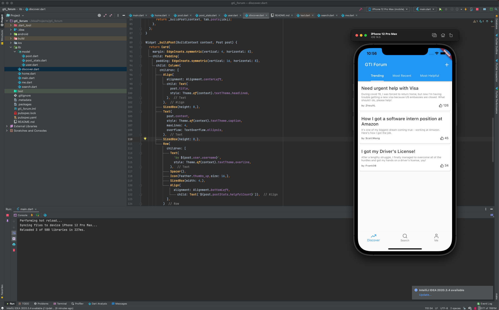
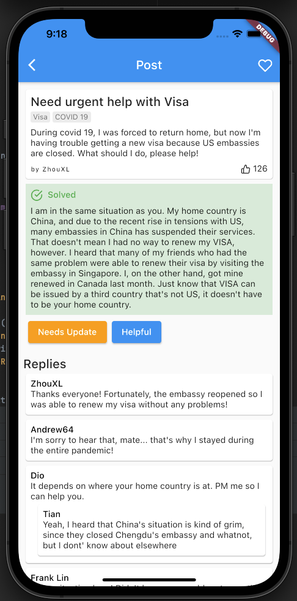

# GTI Forum

Currently, I only have preliminary implementation of the posting system. 

Future Ideas: each post can be marked as solved/unresolved (like Stack Overflow). Each post can have multiple categories.

Currently, this is what the platform looks like:

## Final Prototype with Revision

Here's the completed prototype for the final project, with all promised features & revisions

- Categorize posts by tags
- Helpful/not helpful vote
- Notification of post being outdated, and needs an update
- Solved/unsolved, pinned solutions
- Reply threads and comments.

|  |  |  |
| ---------------------------------- | ---------------------------------- | ---------------------------------- |

